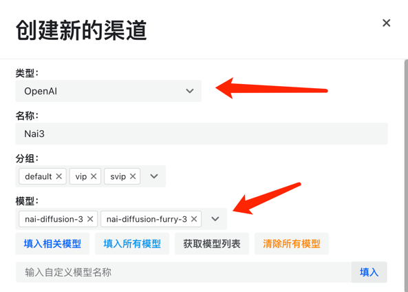
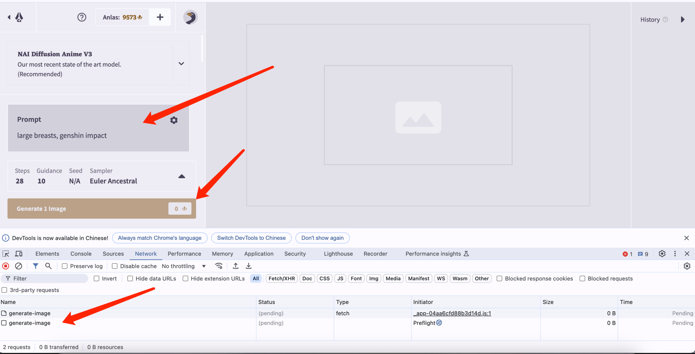
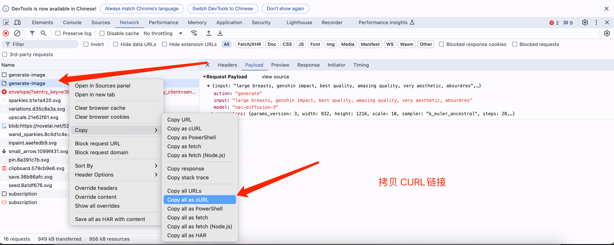
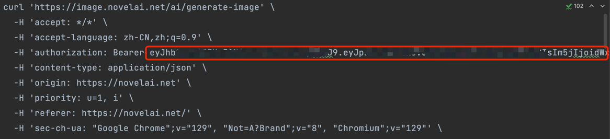
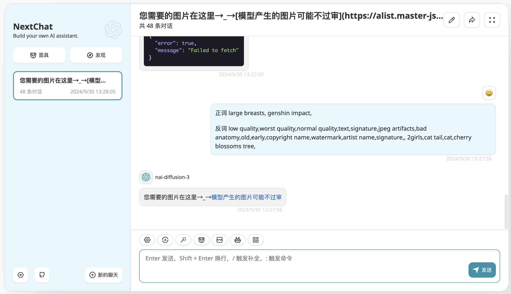

# 项目名称


## 🚀 项目简介

**nai3-api** 使用[GO]语言编写的二进制[API]文件,对接[openai]接口格式来使用[POST]请求NovelAI，并将图片存入到我们的AList网盘中，达到免存储，在线览图的目的。

## 📦 功能特性

- 免磁盘

> [如何安装Alist组件来管理你各大厂商的网盘文件](https://www.master-jsx.top/archives/alistpan)
>
> [如何将Alist中的网盘挂载到Linux系统](https://www.master-jsx.top/archives/alist-linux)

- 以文画图:

```azure
正词 large breasts, genshin impact

反词 low quality,worst quality,normal quality,text,signature,jpeg artifacts,bad anatomy,old,early,copyright name,watermark,artist name,signature,, 2girls,cat tail,cat,cherry blossoms tree,
```


- 以图画图:
```azure
https://lsky.master-jsx.top/i/2024/08/19/66c2d29546ef9.jpg

正词 large breasts, genshin impact,

反词 low quality,worst quality,normal quality,text,signature,jpeg artifacts,bad anatomy,old,early,copyright name,watermark,artist name,signature,, 2girls,cat tail,cat,cherry blossoms tree,
```

## 📖 安装指南

使用以下命令来安装项目：

```bash
# 二进制直接启动
> 下载二进制文件并修改配置文件,将配置文件中的图片存储地址,改成自己挂载Alist磁盘的地址 ./ 启动文件即可

> 默认端口为: 3388

# 使用supervisor启动
[program:Nai3]
command=/opt/app/nai3/nai3
directory=/opt/app/nai3
autorestart=true
startsecs=3
startretries=3
stdout_logfile=/www/server/panel/plugin/supervisor/log/Nai3.out.log
stderr_logfile=/www/server/panel/plugin/supervisor/log/Nai3.err.log
stdout_logfile_maxbytes=2MB
stderr_logfile_maxbytes=2MB
stdout_logfile_backups=2  ; 设置标准输出日志文件的备份数量
stderr_logfile_backups=2  ; 设置标准错误日志文件的备份数量
user=root
priority=999
numprocs=1
process_name=%(program_name)s_%(process_num)02d
```

🚧 使用文档
> 就按照 newapi 为例,类型选择openai格式，模型填写 nai3 官方的模型
> 



> 秘钥获取方式，链接：https://novelai.net/image
> 




> 代理地址 一定要是https的


🙌 感言
```txt
我查了一圈Github发现没人写这种的接口,就自学GO语言写了一个,第一次写,不太会,大家见谅！
```

📞 联系方式
如有任何问题或建议，请通过以下方式联系我：

* 邮箱: Jsx20011014@163.com 
* QQ群: 960566450